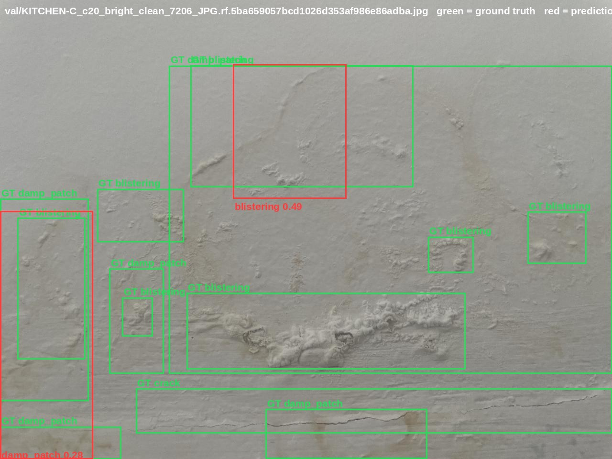
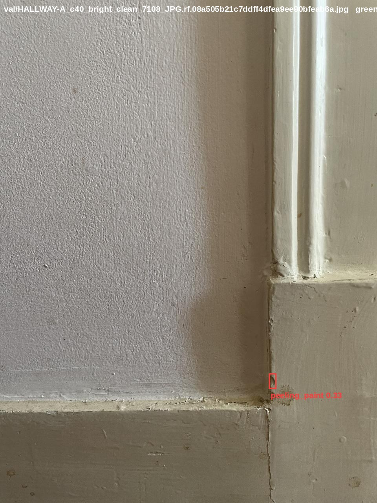
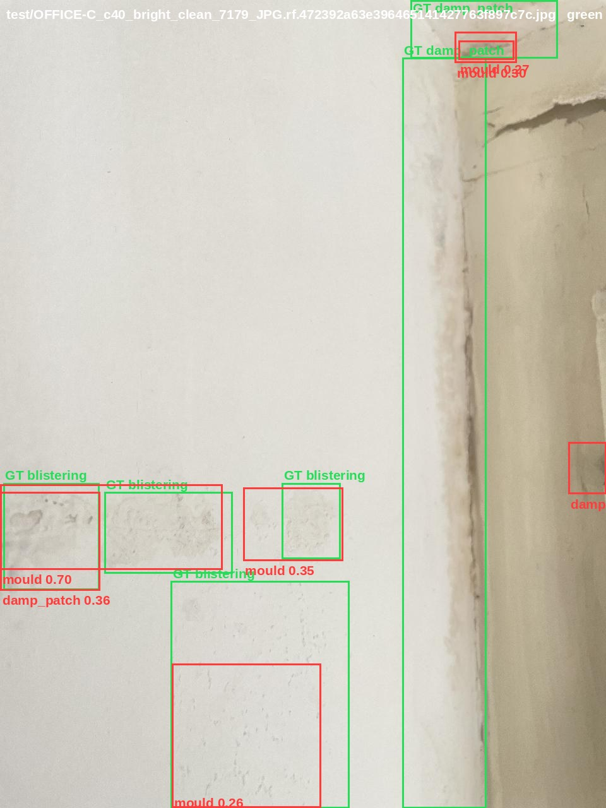
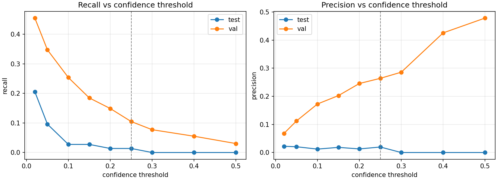

# Error Analysis — Interior Wall Defect Detection

**Dataset:** `interior-wall-defects` v1 · SHA256 `9137b89d2f40…` · 5 classes · 1280 px **Model:** YOLO11s, run 2 · weights SHA256 `cc1d5096124f…` **Primary evaluation split:** **validation** — reasons in #2.3 **Reproduced by:** `notebooks/01_Training.ipynb`, `notebooks/02_Inference.ipynb`

---

## 1. Headline

The detector does not work in operational terms.

|  | validation | test |
| :---- | :---- | :---- |
| mAP50 (*) | 0.086 | — (***) |
| mAP50-95 (*) | 0.033 | — (***) |
| **defects found** (conf 0.25) (**) | **38 of 363** | **1 of 73** |
| **flagged regions that were real** (**) | 38 of 144 | 1 of 51 |

(*) 01_Training.ipynb #9;
(**) 02_Inference.ipynb #6
 (\*\*\*) Test mAP is not quoted: the split cannot support per-class figures (#2.3). Box counts are given instead.

One true positive across the entire test split. That sentence is the honest summary, and it is more useful than the mAP figure because it is the form a surveyor would understand.

**What follows is an account of why**, built from three controlled training runs, a per-class audit of the dataset, a box-by-box error accounting of every prediction, and the shape of the loss curves. Not from an assumption that more data would fix it.

The three mechanisms, ranked by how much of the shortfall each explains:

| # | Mechanism | Evidence |
| :---- | :---- | :---- |
| 1 | **Single-room training domain** — every training instance comes from one small closet; evaluation happens in rooms the model has never seen | split construction vs. per-class counts (#2.2); val recall 0.105 against test recall 0.014 (#5) |
| 2 | **Boundary indeterminacy** on amorphous classes | mAP50 : mAP50-95 of 2.6 : 1 (#5.4); figure FN-1, a prediction over a real defect failing IoU 0.45 (#5.5) |
| 3 | **Under-augmentation** in the initial configuration - too little random variation applied to the training images, so the model memorised them rather than learning what they have in common | run 1 → run 2, +44 % mAP averaged over two runs, and the localisation losses degrade
3–4× faster without it (#4.1, #4.6) |

(1) and (3) compound: a single-room training domain needs *more* augmentation than usual, and run 1 was configured with less.

---

## 2. The dataset as it actually is

Per-split, per-class **instance** counts (boxes, not frames), from `evidence/dataset_audit.csv`:

| split | images | background frames | crack | damp\_patch | mould | blistering | peeling\_paint | instances | inst./image |
| :---- | :---- | :---- | :---- | :---- | :---- | :---- | :---- | :---- | :---- |
| train | 134 | 20 (15 %) | 77 | 290 | 629 | 348 | 86 | 1,430 | 10.7 |
| val | 44 | 3 (7 %) | 46 | 101 | 93 | 116 | 7 | 363 | 8.3 |
| test | 46 | **23 (50 %)** | 25 | 12 | 17 | 12 | 7 | **73** | **1.6** |

### 2.1 This is not primarily a data-volume problem

1,430 training instances is not a small number — 10.7 boxes per image. `mould` alone has **629** training instances and reaches mAP50 = 0.127. A model that has seen six hundred mould colonies and cannot find them is not short of examples. It is short of something else.

### 2.2 Every one of those instances comes from one room

Splits were assigned by room, not at random:

- **train** — closet
- **val** — kitchen + hallway
- **test** — living room + office + bedroom

**Why not a random split.** Each wall surface was photographed repeatedly: up to five
distances × three lighting conditions, so as many as fifteen frames of the same square metre
of wall. Pooling all 224 photographs and drawing 60/20/20 at random would put roughly twelve
of those fifteen frames in training and three in test — so every test frame would have about a
dozen near-duplicates on the training side. The same crack, the same blister, from 20 cm
instead of 40 cm, under electric light instead of daylight.

The model would then score well by recognising a photograph it had effectively already seen.
That is **leakage**, and the resulting figure measures memorisation rather than detection.

Splitting by room makes it structurally impossible: no physical defect can appear on both
sides, because no room does.

**What that costs.** The model's entire training distribution is one small enclosed space.

Within that space the capture protocol varied what it could: five distances (10, 20, 40, 100
and 300 cm) and three lighting conditions (daylight, electric, dim). What it could not vary is
the subject. The closet holds a fixed, small population of physical defects — a few blistered
areas, a few cracks, a few mould colonies — and 134 frames are many *views* of those few
*things*.

So 1,430 boxes is not 1,430 independent examples. The effective sample size is closer to the
number of distinct physical defects, which is an order of magnitude smaller. What the model
has learned is not "mould" but "this mould, on this paint, in this room".

**What changes at evaluation.** Not the finish: the validation and test rooms share a similar
white paint, so surface and substrate are not the confound. Three other things change.

1. The physical defects are entirely different — a new population, not new photographs of the
   same one.
2. The lighting mix is different, though not in the direction that would hurt. Training spans
   three conditions — bright daylight, low daylight, artificial — while evaluation is almost
   entirely bright daylight. The model is examined *within* the lighting range it was trained
   on, so lighting is not a candidate explanation for the results (#2.4).
3. The class mix is different:

| class | train boxes | share of train | val boxes | share of val | change |
|---|---|---|---|---|---|
| mould | 629 | **44 %** | 93 | 26 % | halves |
| blistering | 348 | 24 % | 116 | 32 % | rises |
| damp_patch | 290 | 20 % | 101 | 28 % | rises |
| peeling_paint | 86 | 6 % | 7 | **2 %** | thirds |
| crack | 77 | **5 %** | 46 | **13 %** | more than doubles |

The mismatch is class-specific, not a uniform shift. `blistering` and `damp_patch` shift
modestly. The other three do not:

Both imbalances work against the model. `crack` is the least studied class and is examined two
and a half times more than it was studied. `mould` is the most studied, and is what the model
falls back on when unsure — #5.3 records `damp_patch` and `blistering` being called `mould`
seventeen times between them.

**What this means for every number in this report.** The model is being tested **out of
distribution** — not on new photographs of things it has seen, but on new things, in rooms it
has never been in. That is a considerably harder examination than a random split would have
set, and on a single-building dataset the two cannot be separated: avoiding leakage *is* what
creates the domain shift.

The figures that follow are therefore measured under the hardest evaluation this dataset can
pose. The same weights scored on held-out photographs of the closet itself would be
substantially higher — and close to meaningless for the stated use, which is a surveyor
walking into a building the model has never seen. A different building could be harder still.

### 2.3 The test split is not a usable evaluation set

46 images, half of them deliberate hard negatives, **73 boxes across five classes** — fewer than `crack` alone has in validation. `damp_patch` has 12 test instances; `peeling_paint` has 7\.

A per-class mAP computed on 7 instances is not a weak measurement, it is not a measurement. Normally the test figures would lead, since test never influenced training. Here they cannot:
the split is too small to measure anything per class. So the validation table is reported
first, the test table is published next to it rather than omitted, and the number of instances
behind every figure is stated — n=12, n=7 — so a reader can judge for themselves which numbers
to trust. Rebuilding the test split is data improvement (#7.2).

The concentration has a cause worth naming. The closet was the most damaged room, so it was
photographed first and most thoroughly, and the confuser taxonomy in `class_definitions.md`
was built from what was found there. It became the training set for the same reason it was
photographed first: it held the most defects. The remaining rooms were photographed later,
with the confuser list in hand and hard negatives deliberately sought, and they became
validation and test because they held fewer defects.

So the room-level split carried three correlated properties at once — location, capture
purpose, and defect density — all pointing the same way. Nothing in the process went wrong.
The structure of the capture campaign became the structure of the split, and the split then
inherited every imbalance the campaign had.

### 2.4 Capture conditions are confounded with the split

The capture protocol varied distance and lighting deliberately. The room-level split did not
distribute that variation evenly.

**Distance: recall falls as the camera moves back.** On validation, where support is adequate:

| distance | GT instances | found | recall |
|---|---|---|---|
| 20 cm | 136 | 18 | 0.132 |
| 40 cm | 188 | 16 | 0.085 |
| 80 cm | 17 | 1 | 0.059 |
| 100 cm | 8 | 0 | 0.000 |

(10 cm excluded: 3 instances.)

This confirms `docs/capture_resolution_test.md` from the opposite direction. That test measured
pixels per centimetre at 40 cm and predicted a detection floor; at 100 cm the same defect
subtends 2.5× fewer pixels and falls below it. The prediction was made before any training; the
inference data demonstrates it.

**Operational consequence: capture at 20 cm, and never beyond 40.** This is the one
recommendation in this report that could be acted on today, and it costs nothing.

**Capture regimes are unevenly distributed across the splits.** Each row counts images.

| | train | val | test | |
|---|---|---|---|---|
| context framing (wide shots) | **0** | 1 | 1 | evaluated, never trained |
| 80 cm | **0** | 1 | 0 | evaluated, never trained |
| 10 cm | 4 | 1 | 10 | 3 % of training, 22 % of test |
| 300 cm | 9 | **0** | 0 | trained, never evaluated |

**Evaluated but never trained.** No wide context frames and no 80 cm frames appear in training,
yet the evaluation splits contain both: 27 annotated instances in context frames (11 in
validation, 16 in test) and 17 in the single 80 cm frame. That is **44 of the 436 evaluation
instances — 10 % — in framings the model was never shown.** Those instances were always going
to be missed, and part of the reported recall is measuring that absence rather than the model.

**Trained but never evaluated.** Nine training frames were shot at 300 cm, a distance that
appears nowhere in validation or test. Whatever the model learned from them is untested.

**Badly proportioned.** Close-ups at 10 cm are 3 % of training images and 22 % of test images.
Those ten test frames hold only two annotated instances — they are mostly hard negatives — but
they produced six false positives. So the cost here is false alarms at a scale the model barely
saw, rather than missed defects.

**Lighting, as counts:**

| condition | train | val | test |
|---|---|---|---|
| daylight | 47 (35 %) | 44 (100 %) | 42 (91 %) |
| electric | 53 (40 %) | 0 | 4 (9 %) |
| dim | 34 (25 %) | 0 | 0 |

Validation contains no electric or dim frames, so daylight performance cannot be compared
against artificial-light performance within a split. Lighting and room always change together.
Whether daylight specifically is the difficulty cannot be determined from this data — only by
re-splitting or by new capture.

---

## 3. Experimental record

Three runs, each changing one thing against the previous — an **ablation**: alter a single component and measure the effect, to establish whether that component was earning its place.

All runs: YOLO11s from COCO-pretrained weights, `imgsz=1280`, `batch=8`, `seed=0`, `deterministic=True`, identical dataset bytes verified by SHA256 at the top of every run. Reproduce any of them by changing `RUN_TAG` in `notebooks/01_Training.ipynb` #2.

|  | run 1 | run 2 | run 3 |
| :---- | :---- | :---- | :---- |
| classes | 5 | 5 | 4 (`blistering` ∪ `peeling_paint` → `paint_failure`) |
| `mosaic` | 0.0 | 1.0 | 1.0 |
| `close_mosaic` | — | 30 | 30 |
| `scale` | 0.25 | 0.5 | 0.5 |
| `hsv_v` / `hsv_s` | 0.2 / 0.4 | 0.3 / 0.6 | 0.3 / 0.6 |
| `degrees` / `flipud` / `fliplr` | 0 / 0 / 0.5 | 0 / 0 / 0.5 | 0 / 0 / 0.5 |
| `epochs` / `patience` | 100 / 20 | 150 / 40 | 150 / 40 |
| stopped at epoch | ≈68 | ≈112 | ≈100 |

`mosaic` tiles four images into one canvas; `close_mosaic` is how many final epochs run with it
switched off. `scale` is random resizing, `hsv_v` / `hsv_s` random brightness and saturation,
`degrees` / `flipud` / `fliplr` rotation and flipping — each number being the maximum random
variation applied per image. `patience` is how many epochs without improvement end the run.

Geometric augmentation was held at zero rotation and no vertical flip throughout, deliberately: walls are vertical and rising damp has a top edge. Rotation would destroy a real geometric prior rather than simulate a plausible one.

### Validation results

| run | precision | recall | mAP50 | mAP50-95 | epochs |
|---|---|---|---|---|---|
| 1 | 0.132 | 0.104 | 0.0649 | 0.0252 | 68 of 100 |
| **2a (reported)** | **0.145** | **0.139** | **0.0859** | **0.0332** | **112 of 150** |
| 2b (replicate) | 0.1282 | 0.1836 | 0.1014 | 0.0385 | 135 of 150 |
| 3 | 0.188 | 0.162 | 0.1066 | 0.0395 | 100 of 150 |

**Run 2b is run 2 repeated.** Same configuration, same `seed=0`, same `deterministic=True`, same
dataset bytes, same GPU model — re-run on 2026-10-02 from a deleted Colab runtime as the
reproducibility check for `01_Training.ipynb`. It is the only repeated measurement in this
project and #4.6 is built on it.

> **Run 3's mean is not comparable to runs 1 and 2.** It is computed over four classes instead
> of five, and the class removed (`peeling_paint`, mAP50 = 0.0035) was the worst one. Most of the
> apparent gain is the change of denominator. See #4.3.

> **Run 2a remains the reported model.** `best-run2.pt` is the published asset, and its SHA256 is
> recorded in three places — `README.md`, `governance_checklist.md` and `02_Inference.ipynb` #2.
> Run 2b is a measurement of variance, not a replacement: its weights are different bytes, so a
> different fingerprint, and publishing them would make all three of those checks fail.

### Run 2, per class (the reported model)

| class | precision | recall | mAP50 | mAP50-95 | val instances |
| :---- | :---- | :---- | :---- | :---- | :---- |
| damp\_patch | 0.298 | 0.248 | 0.153 | 0.052 | 101 |
| mould | 0.149 | 0.215 | 0.127 | 0.057 | 93 |
| blistering | 0.236 | 0.147 | 0.107 | 0.043 | 116 |
| crack | 0.044 | 0.087 | 0.040 | 0.013 | 46 |
| peeling\_paint | 0.000 | 0.000 | 0.004 | 0.002 | **7** |

> #### **How to read this?**
> 
> **Read the table right-to-left, not left-to-right** 
> 
> The instinct is to start at `precision` because it's the first number. Wrong instinct. Start at `val instances`, because that column decides whether the rest of the row means anything.
> 
> Four rows have between 46 and 116 instances — enough to say something. One has seven. **Draw a line through the peeling_paint row before you read a single number in it.** Four boxes either way would swing those figures from 0.00 to 0.50. It isn't a bad score; it's no score.
> 
> **Now walk the `damp_patch` row**
> 
> - **101 instances.** Enough. Proceed.
> 
> - **recall 0.248** — it found about a quarter of them. Roughly 25 of 101.
> 
> - **precision 0.298** — of the boxes it drew and called `damp_patch`, about 30 % were right. Which implies it drew around 80 and got 25 of them. So for every correct damp patch, it flagged two more that weren't. Those two numbers are the ones you can say out loud to a surveyor. Everything else is a summary of them.
> 
> - **mAP50 0.153** — the precision/recall trade-off across all confidence thresholds, boiled to one number, counting a box correct at 50 % overlap.
> 
> - **mAP50-95 0.052** — the same, averaged over overlap thresholds from 50 % up to 95 %. Strict.
> 
> - **The ratio: 0.153 ÷ 0.052 ≈ 2.9.** That's the diagnostic. A detector that places edges accurately scores nearly as well under the strict threshold as the lenient one — a ratio near 1.5. At 2.9 the boxes are in the right neighbourhood and the wrong place.
> 
> **Then read down the columns, not across**
> 
> Individual rows tell you about a class. **Comparisons between rows tell you about the model.**
> 
> **Precision versus recall reveals the failure mode:**
> 
> - `mould` — precision 0.149, recall 0.215. Recall exceeds precision: it fires readily, and is often wrong. Trigger-happy. This is the class #5.3 shows everything else collapsing into.
> - `blistering` — precision 0.236, recall 0.147. The reverse: when it commits it's more often right, but it commits rarely. Conservative.
> 
> Same aggregate mediocrity, opposite behaviour. If you only read the mAP column you'd think these two classes failed the same way.
> 
> **The ratio column you have to compute yourself:**
> 
> | **class** | **mAP50 ÷ mAP50-95** |
> | :---- | :---- |
> |  mould | 2.2 |
> |  blistering |  2.5 |
> | damp_patch | 2.9 |
> |  **crack** | **3.1** |
> 
> `crack` has the worst edge precision in the dataset, `mould` the best. Which is exactly what the geometry predicts: a mould colony is a compact blob that sits neatly in a rectangle, while a diagonal hairline crack fills maybe 15 % of its axis-aligned box, so a small error in angle or extent destroys the overlap.

---

## 4. What the three runs establish

### 4.1 Run 1 → 2: Under-augmentation, confirmed

Run 1 disabled mosaic and reduced scale and HSV jitter. The stated justification was resolution:
mosaic tiles four images into one 1280 px canvas, so each source image trains at an effective
~640 px, and `docs/capture_resolution_test.md` established by measurement, before any training,
that hairline cracks do not survive 640.

Restoring augmentation improved the aggregate on both mAP metrics. With the replicate averaged
in, the effect is **larger** than originally reported:

| | run 1 | run 2 (mean of 2a, 2b) | effect |
|---|---|---|---|
| mAP50 | 0.0649 | **0.0937** | **+44 %** |
| mAP50-95 | 0.0252 | **0.0359** | **+42 %** |

The figure first reported was +32 %, from run 2a alone. Averaging the two run 2 measurements
raises it to +44 %, and the two metrics agree on the magnitude — which is the first reason to
believe it is an effect rather than an accident of one run.

**The mechanism is visible independently of the metric, and this is where the replicate earns
its place.** Overfitting shows up as validation loss rising while training loss still falls.
Measured off `results.csv` rather than read off the plot — the plot's y-axis is stretched by the
warm-up spike and is not readable at this scale:

| | run 1 | run 2a | run 2b |
|---|---|---|---|
| `val/box_loss` rise per epoch | 0.0070 | 0.0024 | **0.0018** |
| `val/dfl_loss` rise per epoch | 0.0095 | 0.0044 | **0.0034** |
| `val/cls_loss` rise per epoch | 0.0078 | 0.0023 | **0.0097** |

The two localisation losses tell a consistent story across both run 2 instances: run 1 degrades
**three to four times faster**, and the two run 2 measurements agree within about 13 %. The
effect is an order of magnitude larger than the spread between replicates.

`val/cls_loss` does not. Two runs of the *identical configuration* gave 0.0023 and 0.0097 — a
factor of 4.2 apart, which swamps the run 1 → run 2 difference entirely. **No claim about
classification loss is supportable from this data**, and the earlier draft of this section made
one.

So the defensible statement is narrower than it was, and better founded:

> Augmentation measurably slows the degradation of the **localisation** losses, by a factor of
> three to four, consistently across two independent runs. Its effect on the classification
> loss cannot be measured at this sample size.

**What was removed from this section, and why.** An earlier draft argued that `val/cls_loss`
collapses and stays flat while `box` and `dfl` climb, and concluded that the classification head
generalises while the edge-position head does not. That argument was withdrawn twice, for
independent reasons. First, measured from `results.csv`, `val/cls_loss` does not stay flat in
run 1 — it rises at 0.0078 per epoch, the fastest of the three; the apparent flatness was an
artefact of the plot's y-axis being scaled to the warm-up spike at 330. Second, the epoch at
which each loss reaches its minimum turns out not to replicate at all:

| | run 1 | run 2a | run 2b |
|---|---|---|---|
| `val/box_loss` min epoch | 31 | 48 | 52 |
| `val/cls_loss` min epoch | 31 | 27 | 95 |
| `val/dfl_loss` min epoch | 31 | 50 | 27 |

Only `box` replicates. `cls` and `dfl` effectively trade places between the two run 2 instances.
**Which loss degrades first is not a property of the configuration**, so no interpretation should
rest on it. The localisation claim above survives because it is built on rise *rates*, which do
replicate, not on the ordering of minima, which does not.

The boundary-indeterminacy finding in #5.4 is unaffected: it rests on the mAP50 : mAP50-95 ratio,
which came out at 2.59 : 1 in run 2a and 2.64 : 1 in run 2b.

### 4.2 The refuted sub-prediction

Mosaic was disabled specifically to protect `crack`. `crack` improved **more than any class except `damp_patch`** when mosaic was restored: mAP50 +40 %, mAP50-95 +98 %.

The resolution argument was correct about the mechanism and wrong about which effect dominates. Mosaic does cost effective resolution; that is measurable. But with 134 training images from one room, the overfitting it prevents costs more than the resolution it takes. A second-order term was optimised at the price of a first-order one, on the single class the entire capture protocol was designed around.

One caveat on the gain: `crack` precision fell from 0.164 to 0.044 while recall rose slightly,
and crack's share of all false positives rose from 0.04 to 0.17. The model became markedly less
cautious — it draws far more crack boxes, catches slightly more real cracks, and produces many
more false alarms. For a screening tool tuned to recall that is an acceptable trade, but it is
a trade, and part of the 40 % mAP50 gain reflects reduced caution rather than better detection.

**A second caveat, from #4.6.** The paragraph above qualifies that gain on mechanism — part of
it is reduced caution rather than better detection. This one qualifies it on measurement. Every
per-class figure in this section comes from one run per condition, and the replicate in #4.6
puts aggregate mAP50 variance at ±8 % of the mean, with per-class movement larger still. The
*direction* of `crack`'s change is consistent with the mechanism argued here, and the refutation
of the resolution prediction rests on the aggregate, which clears that margin comfortably. The
specific per-class magnitudes do not, and should be read as single measurements rather than
estimates.

### 4.3 Run 2 → 3: the merge, rejected

`class_definitions.md` pre-registered the option of merging `blistering` and `peeling_paint` into `paint_failure`. Run 2's normalised confusion matrix appeared to supply a reason to test it: true `peeling_paint` → predicted `blistering` = 0.14, against a diagonal of 0.00.

The pre-registered test was whether `paint_failure` beats `blistering`'s 0.107.

|  | mAP50 | mAP50-95 |
| :---- | :---- | :---- |
| `blistering` (run 2\) | 0.1067 | 0.0429 |
| `paint_failure` (run 3\) | **0.1019** | **0.0360** |

It does not. **The merge is rejected**, and the five-class definition stands.

**And the evidence that motivated it turned out to be one box.** The box-level accounting in #5.3 counts `peeling_paint → blistering` at **1 instance**. The 0.14 was one misclassification out of seven validation instances, amplified by column normalisation.

That is a lesson worth carrying beyond this project: **a normalised confusion matrix manufactures dramatic-looking cells out of single instances when class support is small.** It is the same trap as `peeling_paint`'s 0.000 precision, met a second time from a different direction. Absolute counts should be read alongside any normalised matrix.

Note also that the original decision rule was annotator-side — merge if the annotator finds themselves guessing on more than one image in ten. That never happened.

### 4.4 The limit of what run 3 can tell us

Three classes untouched by the merge moved substantially, in both directions:

| class | mAP50 r2 | mAP50 r3 | Δ |
|---|---|---|---|
| crack | 0.0395 | 0.0087 | **−78 %** |
| damp_patch | 0.1525 | 0.1725 | +13 % |
| mould | 0.1271 | 0.1431 | +13 % |

`crack`'s class id changed from 1 to 0 — cosmetic. On 46 validation instances, moving from
0.0395 to 0.0087 is the difference between roughly two correct detections and roughly none.

Unlike run 3's aggregate (#4.3), these three per-class figures *are* comparable across the two
runs: the same class definitions, the same validation instances, only the merge of the other two
classes differs. So the movements are real measurements. The question is what they measure.

**Per-class run-to-run variance at this performance level is comparable to the effects being
tested.** That was asserted here on intuition in the first draft. The replicate (#4.6) now makes
it a measurement, and the comparison is direct — the same three classes, between two runs where
**nothing whatever was changed**, set beside the same classes between run 2 and run 3:

| class | 2a | 2b — *same config, nothing changed* | Δ | r3 — *classes merged* | Δ |
|---|---|---|---|---|---|
| mould | 0.1271 | 0.1853 | **+46 %** | 0.1431 | +13 % |
| damp_patch | 0.1525 | 0.1757 | **+15 %** | 0.1725 | +13 % |
| crack | 0.0395 | 0.0158 | **−60 %** | 0.0087 | −78 % |

For `mould` and `damp_patch`, **changing nothing at all moved the figure further than merging two
classes did.** For `crack`, the two movements are the same order of magnitude. And the signs
agree in every row, which removes the last reading that might have rescued the run 3 numbers: if
the merge had pushed these classes in a direction noise does not, that would be evidence. It
pushed them the same way a re-run does, only less far.

**No per-class movement in run 3 is distinguishable from run-to-run variance.** The ±13 %
figures are not small effects, they are not effects.

What run 3 does establish is the one thing it was built to test: whether `paint_failure` beats
`blistering`. That comparison is like-for-like *within a single run* — both figures come from the
same training, so the variance above does not apply to the difference between them — and it came
out negative (#4.3). The merge is rejected on that basis and on no other.

Run 1 → 2 survives this objection on two independent grounds. The aggregate effect is +44 %
against a replicate spread of ±8 % — roughly five times the noise. And the validation loss rise
rates moved as predicted in **both** run 2 instances, so the mechanism is corroborated by a
measurement that does not depend on mAP at all (#4.1).

**What the replicate is not.** 2b is one alternative draw, not a distribution. It gives a range
rather than a standard deviation, and it measures run 2's variance only — runs 1 and 3 are
assumed comparable. A per-class claim at this performance level needs three or more seeds per
condition. The point of the table above is not that variance is exactly ±46 % on `mould`; it is
that a single observation of the noise already exceeds the effects that were nearly reported as
findings.

### 4.5 An experiment that half ran

`close_mosaic=30` with `epochs=150` switches mosaic off at epoch 120, for an intended fine-detail
finishing phase on untiled images.

| run | stopped at | mosaic closed? | best epoch | did the checkpoint see mosaic-free training? |
|---|---|---|---|---|
| 2a (reported) | 112 | **no** — never reached 120 | ≈72 | no |
| 2b (replicate) | 135 | **yes**, at 120 | **95** | **no** |
| 3 | 100 | no | ≈60 | no |

Run 2b is the first run to reach the switch at all. It then trained 15 epochs with mosaic off —
and produced no checkpoint better than epoch 95. `best.pt` predates the switch by 25 epochs.

So **no reported result in this project comes from weights that ever saw a mosaic-free epoch**,
and the one run that got a finishing phase gained nothing from it. That second observation is
weak — 15 epochs, one run, and the run was already 40 epochs past its best when the switch fired
— but it is the first evidence either way, and it points away from `close_mosaic` being the
cheap win it looked like.

The intended test remains untested. Running it properly means `close_mosaic` large enough that
the switch precedes the likely best epoch — around epoch 60 rather than 120 — not merely
training for longer.

`notebooks/01_Training.ipynb` #10 measures and records this rather than inferring it:
`run_record.json` carries `epochs_trained`, `close_mosaic_off_at_epoch` and
`close_mosaic_engaged`, and prints a warning when the phase never engaged.

### 4.6 What one repeated run reveals

Every comparison above rests on one training run per configuration. The reproducibility check on
`01_Training.ipynb` incidentally produced a second measurement of run 2, and it is the most
useful single piece of evidence in this section — because it measures the noise floor that every
other claim is being compared against.

Run 2b: identical configuration, identical seed, `deterministic=True`, identical dataset bytes
verified by SHA256, same GPU model, cold runtime, no manual intervention.

| | run 2a | run 2b | spread |
|---|---|---|---|
| val mAP50 | 0.0859 | 0.1014 | **±8.3 %** of mean |
| val mAP50-95 | 0.0332 | 0.0385 | ±7.4 % |
| test mAP50 | 0.0134 | 0.0423 | **×3.2** |
| epochs trained | 112 | 135 | +23 |
| best epoch | ≈72 | 95 | +23 |

Three things follow.

**1. Training is not bit-reproducible here, and `deterministic=True` does not make it so.** The
flag constrains cuDNN kernel selection; it does not control dataloader worker scheduling or
non-deterministic reductions on GPU. The claim this repository makes is that the notebook runs
end to end from a cold runtime and produces a model of the same kind — not that it reproduces
`best-run2.pt` byte for byte. Inference, by contrast, *is* exactly reproducible: `02_Inference.ipynb`
returned identical counts across both splits on an independent cold runtime, to the digit.

**2. The validation noise floor is about ±8 % of the mean.** Effects smaller than that are not
measurable with one run per condition. This is what retires the ±13 % per-class movements in #4.4
and puts a caveat on the per-class figures in #4.2. It also gives the +44 % augmentation effect a
denominator: the effect is roughly five times the replicate spread.

**3. The test split's variance is a factor of three, which settles #2.3 from a second
direction.** 73 instances across five classes was argued there to be unable to support a
measurement. Two runs of the same configuration scoring 0.0134 and 0.0423 on it is that argument
restated as a number. Any reading of the test figures as a performance estimate is unsupportable;
they are a direction-of-travel indicator and nothing more.

**What this does not establish.** Run 1 has no replicate, so its variance is assumed comparable
to run 2's rather than measured. Two runs give a range, not a standard deviation. A properly
founded ablation needs three or more seeds per configuration, and the honest position is that
this project has 1, 2, 1 and 1 across its four measurements. The conclusions that survive — the
augmentation effect on localisation losses, the rejection of the merge, the single-room domain
limitation — are those where the effect is several times the one spread that could be measured.

**Noted as a method, not a result.** Running the reproducibility check produced a scientific
result, not just a tick in a checklist. That was not the plan. It is the strongest argument in
this project for doing the boring verification step: it is where the only error bar came from.

---

## 5. Failure taxonomy: beyond performance scores, mapping real‑world failure modes 

Two views of the same model, and they are measured differently — the difference is worth stating because both appear in this repo.

- **The Ultralytics table** (#3) reports precision and recall at each class's best-F1 operating point, using its own internal matching. It answers "how good could this be, tuned per class".  
- **The box-by-box accounting below** (`notebooks/02_Inference.ipynb`, `evidence/per_image_errors.csv`) fixes the threshold at `conf = 0.25` and the match at `IoU ≥ 0.45`, then assigns every ground-truth box and every prediction to exactly one category. It answers "what would a user actually get".

They are not in conflict. The second is lower because it is a fixed, unfavourable operating point — and it is the one that matters for the intended use.

**Totals at `conf = 0.25`:**

| split | GT | predictions | TP | False Negative | False Positive | Class Confusion | recall | precision |
| :---- | :---- | :---- | :---- | :---- | :---- | :---- | :---- | :---- |
| val | 363 | 144 | 38 | 325 | 106 | 20 | 0.105 | 0.264 |
| test | 73 | 51 | **1** | 72 | 50 | 7 | 0.014 | 0.020 |

> **(key)**

> | Split | Meaning | What it shows |
> | :--- | :--- | :--- |
> | GT | Ground‑truth boxes | How many real defects were labelled |
> | Predictions | Model outputs | How many boxes the model drew |
> | TP | True positives | Correct detections (right class, right location) |
> | False Negative | Missed defects | Real defects the model failed to detect |
> | False Positive | Spurious detections | Boxes where the model saw something that wasn’t a defect |
> | Class Confusion | Mislabelling | Boxes where the model found the defect but called it the wrong class |
> | Recall | TP ÷ GT | How many real defects were found |
> | Precision | TP ÷ Predictions | How many detections were correct |

The val-to-test collapse — recall 0.105 to 0.014 — is the single-room training domain (#2.2) expressed as a number. Validation shares a building and a capture protocol with training. The test rooms share only the building.

### 5.1 False Negatives — the dominant failure

325 of 363 validation instances and 72 of 73 test instances produce no matching prediction.

**For a screening tool this is the worst possible distribution of error.** All five classes were specified recall-priority in `class_definitions.md`, because a missed defect is a defect behind a wall somebody is about to sign for, while a false alarm costs a second look. The model delivers the opposite.

Two sub-causes are separable, and #5.5 shows the second:

- **Never detected.** No prediction anywhere near the annotation. Dominant in the test rooms.  
- **Detected, but the box disagrees.** A prediction sits over the defect and fails IoU 0.45, so it is counted as a false positive *and* leaves a false negative behind it. This is the localisation error of #5.4 appearing in the box counts.

### 5.2 False Positives

106 on validation and 50 on test. 23 of the 46 test frames are deliberate hard negatives — the documented confusers from `areas.csv` — and they attract detections.

This is the most interpretable class of error in the set, because a box on a frame with no ground truth names what the model believes it has found, which may be a documented confuser or a real condition outside the class list.

### 5.3 Class Confusion — corrected ranking

Predictions that overlapped a ground-truth box at IoU ≥ 0.45 but carried a different label. **Absolute counts**, validation and test combined:

| true | predicted | count |
| :---- | :---- | :---- |
| **damp\_patch** | **mould** | **11** |
| blistering | mould | 6 |
| blistering | damp\_patch | 5 |
| blistering | crack | 1 |
| crack | peeling\_paint | 1 |
| damp\_patch | blistering | 1 |
| peeling\_paint | blistering | 1 |
| peeling\_paint | mould | 1 |

> These counts come from `notebooks/02_Inference.ipynb` #6 and cover **validation and test
> combined**, matched at a fixed `conf = 0.25` and `IoU = 0.45`. They will not reconcile exactly
> with `evidence/confusion_matrix.png`, which was produced during training, covers **validation
> only**, and uses Ultralytics' own matching procedure. Validation alone accounts for 20 of the
> 27 confusions counted here.

The dominant confusion is **`damp_patch` → `mould`**, not the `blistering` / `peeling_paint` boundary that `class_definitions.md` predicted would be contested.

`damp_patch` → `mould` is the **nesting** problem. Mould almost always sits inside a damp patch and both receive boxes, as specified. The model resolves the overlap toward `mould` — its most numerous training class at 629 instances. Add `blistering` → `mould` (6) and the pattern is clear: **everything collapses toward the majority class.** That is prior skew, not a definition failure.

The nesting contract was correct and deliberate — mould inside damp is a true description of the wall. But it asks the model to distinguish two things that occupy the same pixels, and on this evidence it cannot.

### 5.4 Localization Error

The ratio mAP50 : mAP50-95 is **0.086 : 0.033 ≈ 2.6 : 1**. Boxes that match at the lenient
threshold frequently fail at stricter ones — the model finds approximately the right region
and does not place its edges precisely. Figure FN-1 (#5.5) shows a single instance of it: a
prediction sitting over a real defect, failing IoU 0.45, counted as a false positive and
leaving a false negative behind it.

Stated operational consequence, carried from the class definitions: **the model under-reports
the extent of damp by design. It identifies location, not area.**

### 5.5 The three cases

Selected by sorting `evidence/per_image_errors.csv`, not by eye — ranking the whole split by measured failure counts removes the bias toward whatever looks striking, and the sort is reproducible.

These figures show two things at once, and the second is easy to miss. FN-1 carries thirteen
overlapping ground-truth boxes on a low-contrast wall; the reader can see that deciding where
each one stops was a judgement, not a reading. So the figures are evidence about the
**annotation task** as much as about the model.

That matters for how the whole report is read. Every metric here scores predictions against a
single annotator's single pass, treated as truth. No inter-annotator agreement was measured, so
there is no way to separate *the model was wrong* from *the ground truth was one of several
defensible answers*. Where a prediction sits plausibly but fails IoU 0.45, both readings are
open.

This is a stated limitation, not a defence of the result. It also sets an unmeasured ceiling:
if two passes over the same frames would agree only at IoU 0.6 on `damp_patch`, no model could
exceed that. Measuring it is the cheapest remaining experiment — re-annotate 20 chosen for density
and compute the agreement — and it belongs in v2 before any further training.

---

**FN-1 — detected, but the box disagrees** `evidence/overlays/fn-1-kitchen-c-c20.jpg` · val · 13 ground-truth boxes, 2 predictions, 11 missed

A kitchen wall carrying thirteen annotated instances — nested `damp_patch`, `blistering` and a `crack` — of which the model finds two.

The instructive part is the `blistering 0.49` prediction. It sits over a genuinely blistered region, but *between* two annotated boxes rather than on either. It fails IoU 0.45, so it is counted as a false positive and leaves a false negative behind it.

The model is not blind here. It disagrees with the annotation about where the defect stops. This is #5.4 in a single frame, and it is why the fix is a boundary contract rather than more images.

---

**FP-1 — a real condition with no class to put it in**
`evidence/overlays/fp-1-hallway-a-c40.jpg` · val · 0 ground-truth boxes, 1 prediction

The model predicts `peeling_paint 0.33` at the base of the architrave, on a frame annotated
with no boxes at all.

The frame is not blank. There is a small mark at the corner of the architrave; the architrave
carries many years of accumulated paint layers; and the architrave-to-skirting transition shows
paint-joint cracking from differential movement between elements that were never detailed with
a proper joint filler. A surveyor would notice all of it.

None of it is one of the five classes. "Door frame / architrave junction" is on the do-not-label
list in `class_definitions.md`, accumulated paint build-up is not `peeling_paint`, and
movement-joint cracking is not the plaster fracture that `crack` is defined as. So under the
annotation contract the frame correctly carries an empty label file — and the model, having
found something and possessing only five names, assigned the nearest.

**This is a scope failure, not a perception failure.** The model saw a real surface anomaly.
The label set had no bin for it. The evaluation counts the result as a false positive, which is
correct arithmetic and a misleading description.

Two consequences follow:

1. **Some unknown share of the 156 false positives may be detections of real but out-of-scope
   conditions.** Nothing in this evaluation distinguishes "fired at nothing" from "fired at
   something the class list omits", and the precision figures treat both identically.
2. **For the stated use — screening — the distinction matters more than the metric does.** A
   surveyor sent to look at that junction would find something worth recording. By the report's
   own numbers that is a wasted trip; by the surveyor's judgement it is not.

Auditing the false positives into *nothing there* versus *something unnamed* is a cheap
addition to v2, and it would tell you whether the class list is too short rather than the model
too eager.

---

**CC-1 — found and misnamed** `evidence/overlays/cc-1-office-c-c40.jpg` · test · 6 ground truth, 7 predictions, **0 TP**, 4 class confusions

The model produces roughly the right number of boxes in roughly the right places and gets every label wrong. Zero true positives from six annotated instances.

This frame is the argument for reading class confusion separately from false negatives. Scored only on recall it looks like total blindness. It is closer to the opposite: the detector is working and the classifier is collapsing toward the majority class (#5.3).

---

## 6. The operating point

`conf = 0.25` is the Ultralytics default, not a decision. `notebooks/02_Inference.ipynb` #8 re-scores the *same* predictions across thresholds, so the curve below is the trade genuinely available from this model.

| conf | val recall | val precision | flagged regions per image |
| :---- | :---- | :---- | :---- |
| 0.02 | 0.455 | 0.068 | ~55 |
| 0.05 | 0.347 | 0.112 | ~26 |
| **0.10** | **0.253** | **0.173** | **~12** |
| 0.15 | 0.185 | 0.202 | ~7.5 |
| 0.25 (default) | 0.105 | 0.264 | ~3.3 |

**Recall more than quadruples between 0.25 and 0.02.** The detections exist; the default threshold suppresses them. Any statement of this model's recall that does not name its threshold is incomplete.

But 0.02 is not the answer either: 55 flagged regions per image means the surveyor reviews everything, which is equivalent to having no model.

**Recommended operating point: `conf = 0.10`.** In the terms a user experiences it: *about a quarter of the annotated defects are found, at roughly twelve flagged regions per image, of which about one in six is real.* That is a defensible screening posture for the stated recall-priority; it is not a good one, and it should not be described as one.

---

## 7. Three prioritised improvements

Ranked by what each would tell you, not by effort. The first is deliberately not a change to
the dataset: it determines whether the other two are worth making.

### 1 — Measure the ceiling before improving anything else

**Problem.** Every figure in this report scores predictions against one annotator's single pass,
treated as ground truth. The amorphous classes have no crisp boundary — `damp_patch`, `mould`
and `blistering` are judgements, not readings — so the "correct" box is one of several
defensible answers. Nothing here separates *the model was wrong* from *the target was fuzzy*.

That is not a caveat, it is a missing number. mAP50-95 averages scores at overlap thresholds up
to 0.95. If two annotation passes over the same frames would agree only at IoU 0.6, every
threshold above 0.6 is unreachable by anyone, and the metric has a real maximum far below 1.0.
`damp_patch` scoring 0.052 means something different against a ceiling of 1.0 than against a
ceiling of 0.4.

**Change.** Re-annotate roughly 20 frames, chosen to be dense in `damp_patch`, `mould` and
`blistering` — the three classes whose boundaries are judgements rather than readings — without
reference to the original annotations, then compute the per-class IoU between the two passes.
Twenty frames at this dataset's density gives 50–60 instances of each, enough for a stable mean;
`crack` and `peeling_paint` have mechanical definitions and are not where the uncertainty lies.

Choose frames annotated early in the campaign and not revisited since, so the second pass
measures judgement rather than recall of the first.

**Expected effect.** No improvement in performance at all. It tells you which problem you have.
If self-agreement on `damp_patch` is 0.6, there is real headroom and better data is worth
collecting. If it is 0.3, the output format is wrong — these classes need segmentation masks,
not rectangles — and no amount of additional data fixes it.

A few hours, and it is the cheapest remaining experiment in the project. It is first because
doing #2 and #3 without it risks spending weeks optimising against a target that cannot be hit.

---

### 2 — Rebuild the splits, stratified on everything that currently correlates with room

**Problem.** The room-level split carried three correlated properties at once (#2.2 – #2.4):

- **Domain.** 100 % of training instances come from one closet. Validation recall is 0.105;
  test, in rooms sharing only the building, is 0.014.
- **Purpose.** The closet was photographed first and the confuser taxonomy built from it; the
  later rooms were photographed with that list in hand and hard negatives deliberately sought.
  Test is 50 % background frames against training's 15 %.
- **Capture conditions.** No context-framed and no 80 cm images in training, yet 44 of the 436
  evaluation instances — 10 % — are in those framings. Evaluation is 91–100 % bright daylight
  while 40 % of training was artificial light, so night performance is untested.
- **Measurability.** Test holds 73 instances across five classes, `peeling_paint` at n = 7.
  Per-class test figures are uninterpretable.

**Change.** Split at the **surface** level using the `area_id` field in `areas.csv`, so every
room contributes to every split — then stratify so that each split carries a representative mix
of:

- frame type (defect-bearing versus hard negative), target 10–15 % background throughout
- lighting condition
- capture distance and framing, including context frames

and set a minimum instance count per class before any per-class figure is reported — roughly
100 on this dataset's density.

**Leakage control.** The room-level split existed because multiple frames of one wall are
near-duplicates. Surface-level splitting preserves that *only if* whole surface groups move
together, and corner frames showing two walls must be assigned as a unit to the split holding
both, or excluded. A frame-level random split would reintroduce exactly the leakage the original
design avoided.

**The practical constraint.** Corner frames show two or three surfaces at once, so every wall
appearing in a corner frame is bound to the others in it. Chained together in a small room,
those bindings can reconstitute the whole room and undo the split. Hold corner frames out of the
split entirely — excluded, or reserved as additional holdout — so the walls are independent.

Check also for defects that physically span a corner: if one mould colony crosses the B–C
junction and both surfaces carry boxes for it, separating B and C puts the same physical defect
on both sides.

**Expected effect.** The largest single gain available, and it also makes the test split mean
something. Both of the current headline failures — the val-to-test collapse and the
uninterpretable per-class test figures — are consequences of this one structure.

---

### 3 — Fix the class scheme, in three places

**Problem.** Three separate findings share a root: the five classes do not carve the problem at
its joints.

- **Boundaries.** mAP50 : mAP50-95 is 2.6 : 1 — boxes land in the right region with the wrong
  edges. FN-1 shows a prediction over a real defect failing IoU 0.45.
- **Nesting.** `damp_patch → mould` is the largest confusion at 11 instances, with
  `blistering → mould` at 6 behind it. Mould sits *inside* damp and both receive boxes, as
  specified; the model is asked to distinguish two things occupying the same pixels, and
  resolves toward `mould` — its most numerous training class at 44 % of all boxes.
- **Scope.** FP-1 is a prediction on a frame with no boxes, at a junction that carries a real
  mark, decades of paint build-up, and movement cracking at the architrave-to-skirting
  transition. None of it is one of the five classes, so the contract correctly says no box — and
  the model, finding something and holding only five names, assigned the nearest. Some unknown
  share of the 156 false positives may be detections of real but out-of-scope conditions.

**Change**, in order of cost:

1. **Audit the false positives** into *nothing there* versus *something real but unnamed*.
   Cheap, and it decides whether the class list is too short or the model too eager.
2. **Re-audit the existing annotations** against the core-only rule in a single sitting,
   recording the decision for every boundary case. Consistency matters more here than
   correctness.
3. **Move `damp_patch` and `mould` to instance segmentation**, where a soft irregular boundary
   is a mask evaluated with mask IoU rather than a rectangle discarding most of the shape. The
   Roboflow annotations were drawn as polygons and collapsed to boxes on export; that geometry
   still exists upstream.
4. **Rebalance `mould`**, or accept that everything will continue collapsing into it.

**Expected effect.** Targets the localisation gap and the dominant confusion together. Note that
#1 determines whether step 3 is optional or mandatory.

---

## Method changes, carried forward

Not data improvements, but changes to how the next round should be done.

**Capture at 20 cm; never beyond 40.** Validation recall falls monotonically with distance —
0.132 at 20 cm, 0.085 at 40, 0.059 at 80, 0.000 at 100 (#2.4). This is the one recommendation in
the project that a surveyor could act on today, and it costs nothing.

**Build the confuser taxonomy before capture, not during it.** The do-not-label list was derived
from the first room and applied to the rest, which is how capture purpose became correlated with
room. Either establish it first, or go back and apply it uniformly.

**Annotate one class at a time.** Annotating five classes at once means holding five seven-column
contracts in mind and switching between them every few seconds; what gets applied by image 140 is
a blurred average of all five. One class per pass holds one definition, and settles each class's
boundary convention while seeing all its instances consecutively — which is the only way to
establish a convention for something like `mould`, where the frontier between two colonies has no
answer from first principles, only an agreed one.

Order the passes crisp to amorphous — `crack`, then `blistering` and `peeling_paint` together
since their test is comparative, then `damp_patch`, then `mould` last, by which point everything
that is not mould already carries a box. Cost is roughly double the annotation time, not five
times, since scanning for one thing is far faster than adjudicating five.

**Give `crack` its own model.** 77 training instances, ~1 px feature width at `imgsz=1280`, and
an axis-aligned box that a diagonal crack fills to roughly 15 %. It is mismatched to the task
format rather than merely under-resourced: either a dedicated model with tiled high-resolution
inference, or removed from this dataset's declared scope.

It is reported here rather than quietly dropped because removing a class after seeing its score,
without having pre-registered that decision, is not a defensible move.

---

## 8. Known limitations

### What the measurements cannot tell you

1. **Annotation agreement was never measured, so the ceiling is unknown.** Every figure scores
   predictions against one annotator's single pass, treated as truth. The amorphous classes have
   no crisp boundary, so the "correct" box is one of several defensible answers, and nothing here
   separates *the model was wrong* from *the target was fuzzy*. mAP50-95 averages overlap
   thresholds up to 0.95; if two passes would agree only at IoU 0.6, every threshold above that
   is unreachable by anyone and the metric has a real maximum far below 1.0. This is the first
   thing to fix (#7-1).

2. **The test split cannot support per-class figures.** 73 instances across five classes, 50 %
   background frames, `peeling_paint` at n = 7. Per-class test numbers are reported with their
   support stated, and should not be read as measurements.

3. **10 % of evaluation instances are in capture regimes absent from training.** No context-framed
   and no 80 cm images appear in the training split, yet 44 of the 436 evaluation instances are in
   those framings. Part of the reported recall measures that absence rather than the model (#2.4).

4. **The 156 false positives were not audited.** FP-1 shows the model firing on a real condition —
   paint build-up and movement cracking at an architrave junction — that has no class in the
   scheme. Nothing here distinguishes *fired at nothing* from *fired at something the class list
   omits*, and precision treats both identically (#5.5).

5. **One seed per condition, except run 2.** Run 2 was repeated once; runs 1 and 3 were not.
   The replicate puts the validation noise floor at ±8 % of the mean and the test split at a
   factor of three (#4.6), which is what retires the ±13 % per-class movements between runs 2
   and 3. Run 1 → 2 survives because the effect is several times that spread and the loss rise
   rates moved as predicted in both run 2 instances. Seeds per condition: 1, 2, 1, 1.

6. **Validation is mildly optimistic.** It selected `best.pt` — by fitness, `0.1 × mAP50 +
   0.9 × mAP50-95`, not by loss — and drove early stopping. Reporting it is reporting a maximum.

### What the model was never tested on

7. **Artificial light.** Evaluation is 91–100 % daylight while 40 % of training was artificial.
   Nothing here says how the model performs at night or with the shutters closed (#2.4).

8. **Severity.** No class carries a severity dimension. The model reports what is visible and
   where; it does not assess what it means.

9. **Anything outside residential painted interiors.** Exterior surfaces, non-painted finishes and
   other building types are out of scope and unmeasured.

### Experiments not run

10. **`close_mosaic` only ran once, and too late.** With `epochs=150` and `close_mosaic=30`,
    mosaic switches off at epoch 120. Runs 2a and 3 stopped at 112 and 100 and never reached
    it; the replicate 2b reached 135, so the switch did fire — but `best.pt` was selected at
    epoch 95 and never saw a mosaic-free epoch. **No reported result comes from weights
    trained with mosaic off**, and the intended finishing phase remains untested (#4.5).

### Established constraints

11. **Cracks below 0.5 mm apparent width are not detectable** at the capture distance and
    resolution used — established by measurement in `docs/capture_resolution_test.md` before any
    training, and confirmed afterwards by the fall in recall with distance (#2.4).

12. **Three training images logged in `areas.csv` never reached the export**, identified by the
    log-versus-export cross-check in `notebooks/01_Training.ipynb` #6b and marked `exclude=yes`.

13. **Compute.** Training requires a GPU, and a free Colab account exhausts its allowance in
    roughly three runs at `imgsz=1280` — a real constraint on reproducing this work. Inference
    runs on CPU in minutes.

---

## 9. Operational statement

This model performs **screening, not certification**. It indicates where a surveyor should look. It does not assess severity, depth, moisture content, or structural significance, and its output is not a condition report.

At the performance measured here it does not meet the bar for that screening role either. Finding 38 of 363 annotated defects at the default threshold, or 1 of 73 in unseen rooms, it cannot be used to conclude that a wall is clear. **Absence of a detection carries no information.** It is reported as a baseline and a method, not as a deployable tool.

**Operational tempo: Mode 1 — batch.** Images are captured on site and processed afterwards,
not live. Nothing waits on the result, which is what allows `imgsz=1280` and a model sized for
accuracy rather than speed. A live on-device tool (Mode 3) would have forced a smaller model at
lower resolution, and `docs/capture_resolution_test.md` would have reached a different
conclusion.